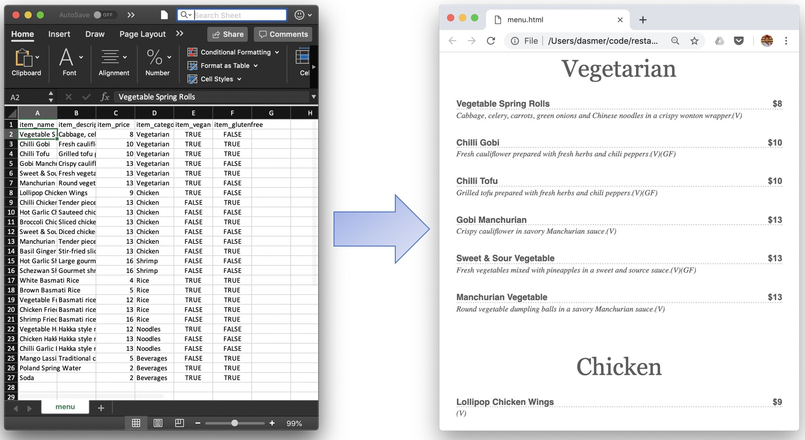

# Piatto

Piatto generates an HTML/CSS web snippet from a CSV spreadsheet of menu items so that you can easily create menu webpages for restaurant websites. 



To start, create a spreadsheet with column names: `item_name`, `item_description`, `item_price`, `item_category`, `item_vegan`, `item_glutenfree`. Add your menu items to the columns. Save the spreadsheet as a CSV.

Clone this repository in command line:

```
git clone https://github.com/dasmer/piatto.git
cd piatto
```
Then copy and paste your CSV file to the newly cloned `piatto` folder. Before running the python script, make sure you have [Beautiful Soup][1] installed. Next, run: 
```
python piatto.py [CSV-MENU-NAME].csv [HTML-MENU-NAME].html
```
where
`[CSV-MENU-NAME]` is  name of your CSV file in this folder.
`[HTML-MENU-NAME]` will be the name of the output HTML file.

Your HTML menu has been generated. To  view it in a browser type:
```
open [HTML-MENU-NAME].html
```
If you use this repository to generate a menu, add a link to it in the "Menus built by Piatto" section below.

I would thrill to see the repository extended to support additional functionality. Pull requests are welcome :octocat:.

## Menus built by Piatto
- [Tandoor Palace][2]
- [Saffron][3]
- [Chinese Dhaba][4]


[1]: https://www.crummy.com/software/BeautifulSoup/bs4/doc/
[2]: https://www.tandoorpalacetogo.com/menu.html
[3]: https://www.asaffronthread.com/menu.html
[4]: https://www.chinesedhabany.com/menu.html
